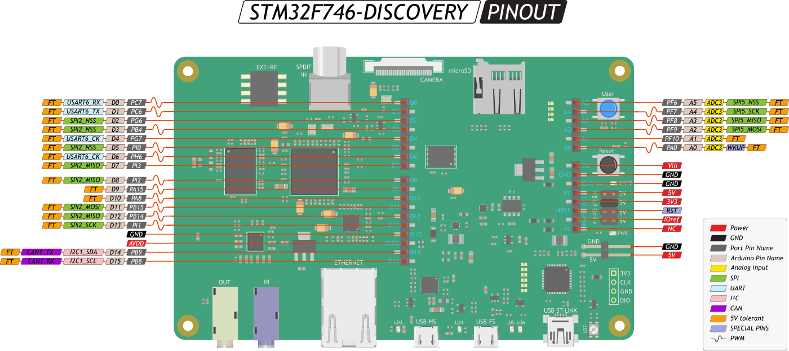
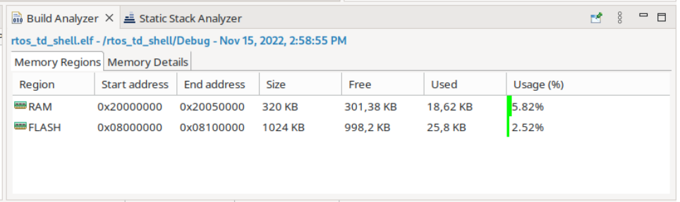

# FreeRTOS_ANOT_BEAUV
TP 3DN-Noyau temps réel

Commande à ajouter dans el main.c

```
int __io_putchar(int ch) {
HAL_UART_Transmit(&huart2, (uint8_t *)&ch, 1, HAL_MAX_DELAY);
return ch;
}
```

1. Où se situe le fichier main.c?

> Le fichier main.c se situe dans le répertoire du projet, puis dans Core/Src/main.c.

1. À quoi servent les commentaires indiquant BEGIN et END?

> Cela permet à l'interprétteur de comprendre que le code entre ces deux marqueurs ne doit pas être écrésé le code a chaque regenérations du projet.

Deux fonctions à utiliser :
>  HAL_Delay

>  HAL_GPIO_TogglePin


1. Quels sont les paramètres à passer à HAL_Delay et HAL_GPIO_TogglePin?
   
```
void HAL_Delay(uint32_t Delay);
void HAL_GPIO_TogglePin(GPIO_TypeDef *GPIOx, uint16_t GPIO_Pin);
```
4. Dans quel fichier les ports d’entrée/sorties sont-ils définis?
   
Les E/S sont définient dans le fichier portant le nom du projet .ioc.

5. Écrivez un programme simple permettant de faire clignoter la LED.
```
/* USER CODE BEGIN WHILE */
  while (1)
  {
    HAL_GPIO_TogglePin(GPIOI, GPIO_PIN_1); // Inverser l'état de la broche PI1 (LD1)
    HAL_Delay(500); // Attendre 500 ms
    /* USER CODE END WHILE */

    /* USER CODE BEGIN 3 */
  }
  /* USER CODE END 3 */
```
6. Modifiez le programme pour que la LED s’allume lorsque le bouton USER est
appuyé.
```
/* Private define ------------------------------------------------------------*/
/* USER CODE BEGIN PD */
#define TASK_LED_BOUTON_PRIORITY 3
#define TASK_LED_BOUTON_STACK_DEPTH 250
/* USER CODE END PD */

/* Private user code ---------------------------------------------------------*/
/* USER CODE BEGIN 0 */
void task_led_bouton(void *unused)
{
	for(;;)
	{
		GPIO_PinState buttonState = HAL_GPIO_ReadPin(GPIOI, GPIO_PIN_11);
		if (buttonState == GPIO_PIN_SET) // Bouton appuyé (niveau haut)
		{
			HAL_GPIO_WritePin(GPIOI, GPIO_PIN_1, GPIO_PIN_SET); // LED ON
		}
		else
		{
			HAL_GPIO_WritePin(GPIOI, GPIO_PIN_1, GPIO_PIN_RESET); // LED OFF
		}
		vTaskDelay(50); / Pour réduire le nombre de passage dans la boucle
	}
}
/* USER CODE END 0 */

int main(void)
{
	// TOUS LES INIT

	/* USER CODE BEGIN 2 */
	BaseType_t returned_value;
	returned_value = xTaskCreate(task_led_bouton,
			"Task LED Bouton",
			TASK_LED__BOUTON_STACK_DEPTH, /*taille de la pile*/
			NULL, /*Paramètre qu'on donne à la fonction task_led -> on a dit qu'on ne s'en servait pas*/
			TASK_LED_BOUTON_PRIORITY,
			NULL);
	if (returned_value != pdPASS) // pas assez de mémoire pour allouer la tâche
	{
		printf("Could not allocate Task LED Bouton\r\n");
		Error_Handler();
	}

	xTaskCreate(task_led_bouton, "Task LED Bouton", TASK_LED_BOUTON_STACK_DEPTH, NULL, TASK_LED_BOUTON_PRIORITY, NULL);

	vTaskStartScheduler(); // Appelle l'OS (avec une fonction freertos)
	/* USER CODE END 2 */

	// LA SUITE AVEC L'INIT DE FREERTOS, LE START SCHEDULER ET LA BOUCLE WHILE.
}

```

## 1 FreeRTOS, tâches et sémaphores

### 1.1 Tâche simple *(enfin il parrait)*
1. Vous pouvez travailler dans le projet créé à la partie précédente Activez FreeRTOS et notez les paramètres qui vous paraissent pertinents. 
   
* En quoi le paramètre TOTAL_HEAP_SIZE a-t-il de l’importance ?
  
    > TOTAL_HEAP_SIZE définit la quantité totale de mémoire RAM réservée aux allocations dynamiques, ce qui est crucial pour éviter les débordements et gérer efficacement les ressources limitées des systèmes embarqués. Une taille appropriée impacte directement la stabilité, les performances et la prédictibilité du programme.


2. Créez une tâche permettant de faire changer l’état de la LED toutes les `100ms` et profitez-en pour afficher du texte à chaque changement d’état.
```
void task_led(void *unused)
{
	for(;;)
	{
		HAL_GPIO_TogglePin(GPIOI, GPIO_PIN_1);
		printf("La LED change d'etat\r\n");
		vTaskDelay(100);
	}
}
```
   
* Quel est le rôle de la macro portTICK_PERIOD_MS ?

    > Quel est le rôle de  sert à `...`


### 1.2 Sémaphores pour la synchronisation

3. Créez deux tâches, `taskGive` et `taskTake`, ayant deux priorités differentes.
   
`TaskGive` donne un sémaphore toutes les 100ms. Affichez du texte avant et après avoir donné le sémaphore. 
`TaskTake` prend le sémaphore. Affichez du texte avant et après avoir pris le sémaphore.

```
void task_give(void *unused)
{
	uart1_rx_semaphore = xSemaphoreCreateBinary();

	for(;;)
	{
		printf("AVANT GIVE\r\n");
		xSemaphoreGive(uart1_rx_semaphore);
		vTaskDelay(100);
		printf("APRES GIVE\r\n");
	}
}


void task_take(void *unused)
{
	uart1_rx_semaphore = xSemaphoreCreateBinary();

	for(;;)
	{
		printf("AVANT TAKE\r\n");
		xSemaphoreTake(uart1_rx_semaphore, HAL_MAX_DELAY);
		printf("APRES TAKE\r\n");
	}
}

```

4. Ajoutez un mécanisme de gestion d’erreur lors de l’acquisition du sémaphore.
On pourra par exemple invoquer un reset software au STM32 si le sémaphore n’est pas acquis au bout d’une seconde.

5. Pour valider la gestion d’erreur, ajoutez 100ms au delai de TaskGive à chaque itération.
```
void task_give(void *unused)
{
	uart1_rx_semaphore = xSemaphoreCreateBinary();

	for(;;)
	{
		printf("AVANT GIVE\r\n");
		xSemaphoreGive(uart1_rx_semaphore);
		vTaskDelay(200);
		printf("APRES GIVE\r\n");
	}
}


void task_take(void *unused)
{
	uart1_rx_semaphore = xSemaphoreCreateBinary();

	for(;;)
	{
		printf("AVANT TAKE\r\n");
		if (xSemaphoreTake(uart1_rx_semaphore, 1000) == pdFALSE) // Si le sémaphore n'est pas acquis au bout d'une seconde
		{
			NVIC_SystemReset(); // RESET
		}
		printf("APRES TAKE\r\n");
	}
}

```  

6. Changez les priorités. Expliquez les changements dans l’affichage.

> Avec ces priorités (GIVE + prioritaire que TAKE) :
```
#define TASK_GIVE_PRIORITY 1
#define TASK_TAKE_PRIORITY 2
```
On obtient :
```
AVANT TAKE (1)
AVANT GIVE
APRES GIVE
AVANT GIVE
APRES GIVE
AVANT GIVE
APRES GIVE
AVANT GIVE
APRES GIVE
AVANT GIVE
AVANT TAKE
```
On fait un TAKE (1), on attend 1 seconde (10x100ms), pas de GIVE donc on RESET et on retourne avant le TAKE.

> Avec ces priorités (TAKE + prioritaire que GIVE) :
 ```
#define TASK_GIVE_PRIORITY 2
#define TASK_TAKE_PRIORITY 1
```
On obtient :
```
AVANT GIVE (1)
APRES TAKE (2)
AVANT TAKE (3)
APRES GIVE (4)
AVANT GIVE
APRES TAKE
AVANT TAKE
APRES GIVE
```
On est avant le GIVE (1), on attend la fin du TAKE, on se retrouve après le TAKE (2). On reboucle donc on est avant le TAKE (3). On a TAKE donc on peut GIVE et on se retrouve après GIVE (4).

### 1.3 Notification

7. Modifiez le code pour obtenir le même fonctionnement en utilisant des task notifications à la place des sémaphores.
```
`...`
```
### 1.3 Queues
8. Modifiez `TaskGive` pour envoyer dans une queue la valeur du timer. 
```
`...`
```
9.  Modifiez `TaskTake` pour réceptionner et afficher cette valeur.
```
`...`
```
### 1.5 Réentrance et exclusion mutuelle

9. Recopiez le code ci-dessous – au bon endroit – dans votre code.
```
#define STACK_SIZE 256
#define TASK1_PRIORITY 1
#define TASK2_PRIORITY 2
#define TASK1_DELAY 1
#define TASK2_DELAY 2
```

```
ret = xTaskCreate(task_bug, "Tache 1", STACK_SIZE, \
(void *) TASK1_DELAY, TASK1_PRIORITY, NULL);
configASSERT(pdPASS == ret);
ret = xTaskCreate(task_bug, "Tache 2", STACK_SIZE, \
(void *) TASK2_DELAY, TASK2_PRIORITY, NULL);
configASSERT(pdPASS == ret);
```

```
void task_bug(void * pvParameters)
{
    int delay = (int) pvParameters;
    for(;;)
        {
        printf("Je suis %s et je m'endors pour \%d ticks\r\n", pcTaskGetName(NULL), delay);
        vTaskDelay(delay);
        }
}

```

10. Observez attentivement la sortie dans la console. Expliquez d’où vient le problème.

    > Le problème proviens de `...`

11. Proposez une solution en utilisant un sémaphore Mutex.
```
`...`
```

## 2 On va essayer de jouer avec le Shell
# Attention !
> Pour ce TP, il y a une petite subtilité. 
> Seules les interruptions dont la priorité est supérieure à la valeur 
> - `configLIBRARY_MAX_SYSCALL_INTERRUPT_PRIORITY` (définie à `5` par défaut)
> peuvent appeler des primitives de FreeRTOS. 
> 
> On peut :
> - soit modifier ce seuil, 
> 
> - soit modifier la priorité de l’interruption de l’USART1 (0 par défaut). 
>     Dans l’exemple montré en Figure 1, la priorité de l’interruption de l’USART1 est fixée à 5.
#
1. Terminer l’intégration du shell commencé en TD. Pour mémoire, les questions
du TD sont rappelées ci-dessous :
   * Créer le projet, compiler et observer. Appeler la fonction depuis le shell.
   Les fichiers sont disponibles sur moodle, dans la section TD.
   * Modifier la fonction pour faire apparaître la liste des arguments.
   * Expliquer les mécanismes qui mènent à l’exécution de la fonction.
   * Quel est le problème ?
   * Proposer une solution

2. Que se passe-t-il si l’on ne respecte pas les priorités décrites précédemment ?

    > Si on ne respecte pas les priorités décrites précédemment, `...`

3. Écrire une fonction `led()`, appelable depuis le shell, permettant de faire clignoter la LED (PI1 sur la carte). 
   
    Un paramètre de cette fonction configure la periode de clignotement. Une valeur de 0 maintient la LED éteinte.
    
    Le clignotement de la LED s’effectue dans une tâche. Il faut donc trouver un moyen de faire communiquer *proprement* la fonction led avec la tâche de clignotement.
```
`...`
```

4. Écrire une fonction `spam()`, semblable à la fonction `led()` qui affiche du texte dans la liaison série au lieu de faire clignoter les LED. 
   On peut ajouter comme argument le message à afficher et le nombre de valeurs à afficher. 

    > *Ce genre de fonction peut être utile lorsque l’on travaille avec un capteur.*


## 3 Debug, gestion d’erreur et statistiques
*Ce TP se réalise dans le même projet, à la suite du TP précédent. On part donc du principe que le shell est fonctionnel et utilise un mécanisme d’OS (sémaphore, queue ou notification) pour la synchronisation avec une interruption.*


### 3.1 Gestion du tas
*Un certain nombre de fonctions de l’OS peuvent échouer.*
*Les fonctions finissant par Create font de l’allocation dynamique et peuvent échouer s’il n’y a plus assez de mémoire.*

1. Quel est le nom de la zone réservée à l’allocation dynamique ?
    > Il sagit du `...`

2. Est-ce géré par FreeRTOS ou la HAL ?
    > C'est `FreeRTOS` / `HAL` qui le gère

3. Si ce n’est déjà fait, ajoutez de la gestion d’erreur sur toutes les fonctions
pouvant générer des erreurs. En cas d’erreur, affichez un message et appelez la fonction 
* Error_Handler();
  
4. Notez la mémoire RAM et Flash utilisée, comme dans l’exemple ci-dessous
   

5. Créez des tâches bidons jusqu’à avoir une erreur.
   > screen de l'erreur

6. Notez la nouvelle utilisation mémoire.
   > la nouvelle utilisation mémoire `...`

7. Dans CubeMX, augmentez la taille du tas `(TOTAL_HEAP_SIZE)`. Générez le code, compilez et testez.
```
`...`
```
8. Notez la nouvelle utilisation mémoire. Expliquez les trois relevés.

   > Le relevé n°1 correspond à `...`

   > Le relevé n°2 correspond à `...`

   > Le relevé n°3 correspond à `...`

### 3.2 Gestion des piles
*Dans cette partie du TP, vous allez utiliser un hook `(une fonction appelée par l’OS, dont on peut écrire le contenu)` pour détecter les dépassements de pile `(Stack Overflow en anglais)`.*
1. Lisez la doc suivante :
    > https://www.freertos.org/Stacks-and-stack-overflow-checking.html
# notions de la doc :
- Chaque tâche a sa propre pile.
- La taille de la pile est définie lors de la création de la tâche (xTaskCreate() alloue dynamiquement, xTaskCreateStatic() nécessite une pré-allocation).
- Le débordement de pile est une cause d'instabilité.
- FreeRTOS offre deux mécanismes optionnels de détection via configCHECK_FOR_STACK_OVERFLOW (1 ou 2).
- Si la vérification est activée (configCHECK_FOR_STACK_OVERFLOW != 0), une fonction hook vApplicationStackOverflowHook() doit être fournie par l'application.
- La fonction hook reçoit des informations sur la tâche fautive (handle et nom), qui peuvent être corrompues en cas de débordement sévère.
- La vérification de débordement introduit une surcharge et est recommandée principalement pour le développement et les tests.
* Méthode 1 (rapide) : Vérifie si le pointeur de pile reste dans la plage valide après la commutation de contexte.
* Méthode 2 (plus complète) : Vérifie si les 16 derniers octets de la pile (initialisés avec une valeur connue) ont été écrasés.
* Méthode 3 (spécifique à certains ports) : Active la vérification de la pile des ISR et déclenche une assertion en cas de débordement (pas de fonction hook).
#  
2. Dans CubeMX, configurez `CHECK_FOR_STACK_OVERFLOW`

3. Écrivez la fonction `vApplicationStackOverflowHook`. 
> *(Rappel : C’est une fonction appelée automatiquement par FreeRTOS, vous n’avez pas à l’appeler vous-même).*

4. Débrouillez vous pour remplir la pile d’une tâche pour tester. 
   * Notez que, vu le contexte d’erreur, il ne sera peut-être pas possible de faire grand chose dans cette fonction. 
   * Utilisez le debugger.


5. Il existe d’autres hooks. Expliquez l’intérêt de chacun d’entre eux.

### 3.3 Statistiques dans l’IDE
*On peut afficher un certain nombre d’informations relatives à FreeRTOS dans STM32CubeIDE en mode debug.*
1. Dans CubeMX, activez les trois paramètres suivants :
> * GENERATE_RUN_TIME_STATS
> * USE_TRACE_FACILITY
> * USE_STATS_FORMATTING_FUNCTIONS

2. Générez le code, compilez et lancez en mode debug

3. Pour ajouter les statistiques, cliquez sur `Window` > `Show View` > `FreeRTOS` > `FreeRTOS Task List`. 

*Vous pouvez aussi afficher les queues et les sémaphores.*


4. Lancez le programme puis mettez-le en pause pour voir les statistiques.
    > screen des statistiques 


5. Cherchez dans CubeMX comment faire pour afficher l’utilisation de la pile.
En mode debug, cliquez sur `Toggle Stack Checking` (dans l’onglet `FreeRTOSTask List` en haut à droite).


6. Pour afficher le taux d’utilisation du CPU, il faut écrire les deux fonctions suivantes :
# 1
```
void configureTimerForRunTimeStats(void);
```
#
# 2
```
unsigned long getRunTimeCounterValue(void);
```
#
* La première fonction doit démarrer un timer
* la seconde permet de récupérer la valeur du timer. 

*Si vous utilisez un timer 16 bits, il faudra peut-être bricoler un peu.*
*Encore une fois, ce sont des hooks, elles sont donc automatiquement appelées par l’OS.*


7. Affichez les sémaphores et les queues.
    > screen des sémaphores et les queues. 

8. Si vous n’en utilisez pas dans votre projet, créez deux tâches qui se partagent une queue ou un sémaphore.


9. Pour leur donner un nom compréhensible, utilisez la fonction `vQueueAddToRegistry`.


### 3.4 Affichage des statistiques dans le shell

Vous pouvez vous référer à la documentation de FreeRTOS en suivant ce lien :

> https://www.freertos.org/rtos-run-time-stats.html

Deux fonctions seront utile à cette partie du TP :
```
void vTaskGetRunTimeStats(char * pcWriteBuffer);
```
```
void vTaskList(char * pcWriteBuffer);
```
1. Écrire une fonction appelable depuis le shell pour afficher les statistiques dans le terminal.
```
`...`
```

## 4 Écriture d’un driver
*Ce TP se fait à la suite du TP précédent, dans le même projet.*
*L’objectif est d’écrire un driver réutilisable pour l’accéléromètre ADXL345.*
### 4.1 Interfacer l’ADXL345
1. Dans le fichier `ioc`, configurez les pins suivantes :
> * PB14 : SPI2_MISO
> * PB15 : SPI2_MOSI
> * PI1 : SPI2_SCK
> * PG7 : GPIO_EXTI7 (nommez le INT)
> * PB4 : GPIO_Output (nommez le NSS), doit être à High par défaut.

2. Configurez le `SPI2` en Mode `Full-Duplex Master`, puis configurez :
> * Frame Format    : Motorola
> * Clock Polarity  : High
> * Clock Phase     : 2 Edge
> * CRC Calculation : Disabled
> * NSS Signal Type : Software
> * Prescaler       : Valeur permettant d’avoir un Baud Rate compatible avec le composant (voir datasheet ADXL345)
> * Pour le reste, voir la datasheet. https://www.analog.com/media/en/technical-documentation/data-sheets/adxl345.pdf

3. Câblez le composant sur la carte Discovery :
> * VCC  sur le 5V
> * GND  sur GND
> * CS   sur D3
> * SDO  sur D12
> * SDA  sur D11
> * SCL  sur D13
> * INT1 sur D4
> * INT2 non connectée.

### 4.2 Premiers tests
*L’ADXL345, comme beaucoup de capteurs, est constitué de plusieurs registres.*
*Ces registres sont accessible à travers un bus SPI.*
1. Créez une fonction appelable depuis le shell pour faire vos tests.
   
Le registre DEVID (adresse 0x00) est une constante qui permet de tester la communication SPI. Pour lire un registre, il faut d’abord écrire l’adresse, puis lire la valeur, dans la même trame SPI. Inspirez vous de l’exemple ci-dessous.
```
HAL_GPIO_WritePin(NSS_GPIO_Port, NSS_Pin, GPIO_PIN_RESET);

HAL_SPI_Transmit(&hspi2, &address, 1, HAL_MAX_DELAY);

HAL_SPI_Receive(&hspi2, p_data, size, HAL_MAX_DELAY);

HAL_GPIO_WritePin(NSS_GPIO_Port, NSS_Pin, GPIO_PIN_SET);
```
2. Dans la fonction shell, écrivez un code permettant de récupérer la valeur du `DEVID`, et vérifiez si elle est correcte.
```
`...`
```

3. Quelles sont les valeurs à mettre dans les registres `INT_ENABLE` et `POWER_CTL` pour démarrer la mesure et délencher une interruption à chaque mesure ?
   
    > les valeurs à mettre dans les registres `INT_ENABLE` et `POWER_CTL` sont `...`

4. À la suite du code précédent, dans la fonction shell, écrivez un code permettant de lire `4 valeurs` consécutives. Utilisez du `polling` pour attendre que la broche `INT1` passe à `High`.
```
`...`
```

5. Faites la moyenne de ces quatre valeurs, mettez les accélérations en forme, et affichez-les à travers l’UART.

    > Screen de l'UART
```
`...`
```

### 4.3 Driver SPI
1. Créez un dossier `adxl345` à la racine.


2. Ajoutez le dossier au path (`Click droit` > `Add/Remove include path` ...)


3. `Project` > `Properties`, puis `C/C++ General` > `Paths and Symbols` > `Source Location`, cliquez sur `Add Folder` puis choissisez le dossier `adxl345`.


4. Dans ce dossier, créez deux fichiers `drv_spi.c` et `drv_spi.h`.


5. Créez également deux fichiers `adxl345.c` et `adxl345.h`.


6. Dans `drv_spi.h`, écrivez le prototype des trois fonctions suivantes :
    > int drv_spi_init(void);

    > int drv_spi_write(uint8_t address, uint8_t * p_data, uint16_t size);

    > int drv_spi_read(uint8_t address, uint8_t * p_data, uint16_t size);


7. Écrivez le contenu des fonctions dans le fichier `drv_spi.c`. 
   * La fonction d’initialisation ne fait rien pour l’instant. 
   * Les fonctions read et write utilisent les fonctions de la HAL. 
   * Pour l’instant vous n’utiliserez pas d’interruption.


8. Testez le driver dans le code précédent.

### 4.4 Squelette du driver

# DEUS VULT 8/8


